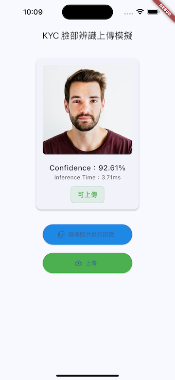

# flutter_face_detector

A Flutter plugin that integrates **Google Edge AI (MediaPipe Tasks Vision)** for on-device **face detection**.  
This package provides a simple and efficient interface for running real-time face detection directly on Android and iOS devices — **no cloud connection required**.

---

## 🆕 Release Notes

## 0.0.5 - Dart format
- fix dart format issue

## 0.0.4 - Downgrade iOS min deployment SDK
- upgrade ios min sdk to 13

## 0.0.3 - Improve example
- Updated example app to simulate a real **KYC ID verification** workflow.  
- Enhanced UI/UX with clearer confidence feedback and upload button logic.  
- Improved confidence parsing (supports values like `"92.61%"`).  
- Added visual styling and status indicators for different detection levels.


### **0.0.2 – Stable Preview Update**
- Fixed package metadata and pubspec formatting for pub.dev compliance.  
- Added full README, CHANGELOG, and LICENSE files.  
- Updated Android Gradle and Kotlin versions for build stability.
- Improved face detection API wrapper with more robust error handling.  
- Verified compatibility with Flutter 3.24+ and Android 14 (API 34).  
- Deprecated the previous misuploaded version `0.0.1`.

---

## ✨ Features

- 🚀 **Edge AI powered:** Uses [MediaPipe Tasks Vision](https://developers.google.com/mediapipe/solutions/vision/face_detector) for high-performance local inference  
- 📸 **Detect faces from images** (Uint8List or file input)  
- 🧠 Returns **detection confidence** and **inference time**  
- 💡 Fully **offline**, no data leaves the device  
- 🔧 **Easy integration** with Flutter apps  
- ⚙️ Works seamlessly with custom image pickers (e.g., [wechat_assets_picker](https://pub.dev/packages/wechat_assets_picker))

---

## 📱 Platform Support

| Platform | Supported | Notes |
|-----------|------------|-------|
| Android | ✅ | Requires `minSdkVersion: 24` |
| iOS | 🔜 Planned | Upcoming support for iOS MediaPipe Tasks |
| Web | ❌ | Not supported (requires native inference) |
| macOS / Windows / Linux | ❌ | Not supported |

---

## 🧠 Example KYC Simulation

In the included example app, users select an image for **face verification**.  
The app analyzes the face and displays an appropriate UI response depending on confidence level:

| Confidence Range | Status Message | Example Image |
|------------------|----------------|----------------|
| ≤0.2 | 完全不像人臉呀 |  |
| 0.2–0.8 | 你確定是證件照嗎？ / 臉部辨識不出來 |  |
| ≥0.8 | 可上傳 |  |

---

## 🧩 Installation

Add the following line to your `pubspec.yaml`:

```yaml
dependencies:
  flutter_face_detector: ^0.0.3
